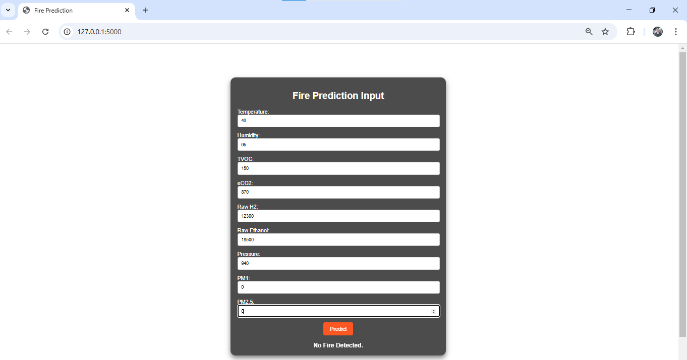

## Steps to Set Up the Project

1. **Install Anaconda**  
   Download and install [Anaconda](https://www.anaconda.com/).

2. **Create a Virtual Environment**  
   Open your terminal and run the following commands:  
   ```bash
   conda create -n <environment_name> python=<python_version>
   conda activate <environment_name>
   ```

3. **Create a `requirements.txt` File**  
   List all the required dependencies in a `requirements.txt` file, for example:  
   ```plaintext
   dependency1
   dependency2
   dependency3
   ```

4. **Install Dependencies**  
   Install the required dependencies using:  
   ```bash
   pip install -r requirements.txt
   ```

5. **Run Notebook Files**  
   Open `.ipynb` files in your IDE (e.g., VS Code or Jupyter Notebook). Make sure to select the correct kernel matching the virtual environment.

6. **Run the Application**  
   Run the application script using:  
   ```bash
   python app.py
   ```

7. **Access the Application**  
   Once the application is running, copy and open the link displayed in the terminal (e.g., `http://127.0.0.1:5000/`) in your browser.
```
